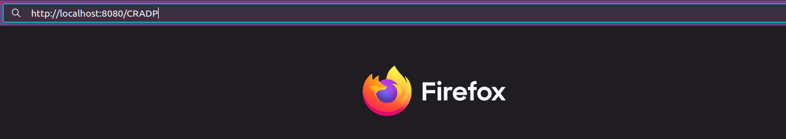

# URL Shortener

A URL Shortener API built with FastAPI and SQLite, allowing users to create shortened URLs, handle link expiration, and manage URL redirection. The API also includes a feature to periodically deactivate expired URLs by setting an `is_active` flag to `False` to free up the URLs for reuse.

## Features

- Generate a unique short URL for a given long URL.
- Redirect users to the original URL when the short URL is accessed.
- Support URL expiration where URLs are no longer accessible after a certain period.
- Support custom URL expiration times.
- Periodically deactivate expired URLs by setting `is_active` to `False`, freeing up the URLs for reuse.
- Option to return the "long URL", "remaining time until expiration" in JSON format.
- Support adjustable short URL length.

## Requirements

- **Python 3.12**
- **FastAPI**
- **Uvicorn** (server for running FastAPI)
- **SQLAlchemy** (ORM for interacting with the database)
- **APScheduler** (for scheduling periodic tasks)
- **SQLite** (database)

## Installation
1. **Clone the repository**:

   ```bash
   git clone https://github.com/Inf-YifanYang/URL-Shortener.git
   cd URL-Shortener
   
2. **Install dependencies**:
   ```bash
   pip install -r requirements.txt

3. **Directory structure**:
   ```
   URL-Shortener/
   ├── app/
   │   ├── config.py
   │   └── database.py
   |   └── main.py
   |   └── schemas.py
   |   └── utils.py
   └── demo.ipynb
   └── demo.html (in case you want to see the results without running the code)
   └── server_setup.sh
   └── url_shortener.db (will be created at first-time running the application)
   ```

3. **Run the application**:
   ```bash
   bash server_setup

   # This will start the FastAPI app on http://127.0.0.1:8080.

## Run Demo 
   There is a demo showing the features of using and interacting with API: Run `demo.ipynb` using Jupyter Lab or open `demo.html` using browser to see the results.

## Endpoints
1. **Shorten a URL**:
   - Endpoint: /service
   - Method: POST
   - Request Body:

     ```json
      {
         "long_url": "https://www.keysight.com/us/en/home.html",
         "expiration_minutes": 20
      }
   - Response:
     
     ```json
      {
         "long_url": "https://www.keysight.com/us/en/home.html",
         "expiration_minutes": 20,
         "expiration_time": "2024-09-27T02:30:04.797886",
         "creation_time": "2024-09-27T02:10:04.797886",
         "short_url": "CRADP",
         "is_active": true
      }
     
2. **Redirect to Original URL**:
   - Endpoint: /{short_url}
   - Method: GET
   - Description: Redirects to the original URL if it is still active and hasn't expired.
   - Request: http://127.0.0.1:8080/{short_url}
   - Using shortened URL:
     
      
      
   - Redirect to original URL:
     
      
      
3. **Obtain the Original URL and Remaining Time before Expiration**:
   - Endpoint: /info
   - Method: GET
   - Request: http://127.0.0.1:8080/info/{short_url} 
   - Response:
     
     ```json
      {
         "long_url": "https://www.keysight.com/us/en/home.html",
         "remaining_time": "00:17:13",
         "expiration_minutes": 20,
         "expiration_time": "2024-09-27T02:30:04.797886",
         "creation_time": "2024-09-27T02:10:04.797886",
         "short_url": "CRADP",
         "is_active": true
      }
     
## Scheduling Deactivating The Expired URLs
The project uses APScheduler to periodically disable expired URLs by setting the is_active flag to False. This task runs every minute (or the interval you set).

To Start the Scheduler
By default, the scheduler starts automatically when the FastAPI app is launched. It checks for expired URLs every minute and disables them.

To adjust the interval, modify the following in main.py:
   ```python
   def start_scheduler():
      scheduler = BackgroundScheduler()
      scheduler.add_job(deactivate_expired_urls, 'interval', minutes=1)  # scan every minutes, can be set to large number
      scheduler.start()
   ```

## Adjustable Short URL Length
To adjust the short URL length, modify the following in config.py:
   ```python
   SHORTEN_URL_SIZE: int = 5 # can be set to customized number
   ```

## Database Schema
The application uses SQLAlchemy for database management. The main table, URLMapping, includes the following columns:

   - id: Integer (Primary Key)
   - long_url: String (The original long URL)
   - short_url: String (The generated short URL)
   - creation_time: DateTime (The time when the URL created)
   - expiration_time: DateTime (The time when the URL expired)
   - is_active: Boolean (Indicates whether the URL is still active)

## Deployment
For production, consider using:
   - Docker: Containerize the app for easy deployment.
   - MySQL: Use a production-grade database instead of SQLite.
